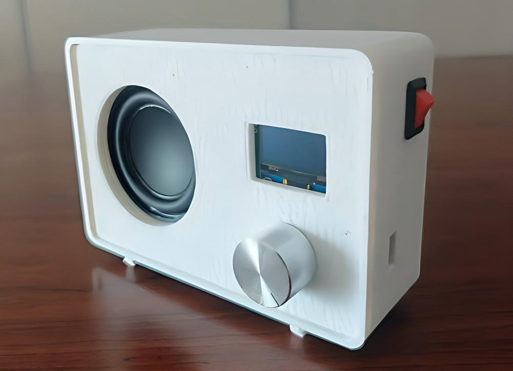
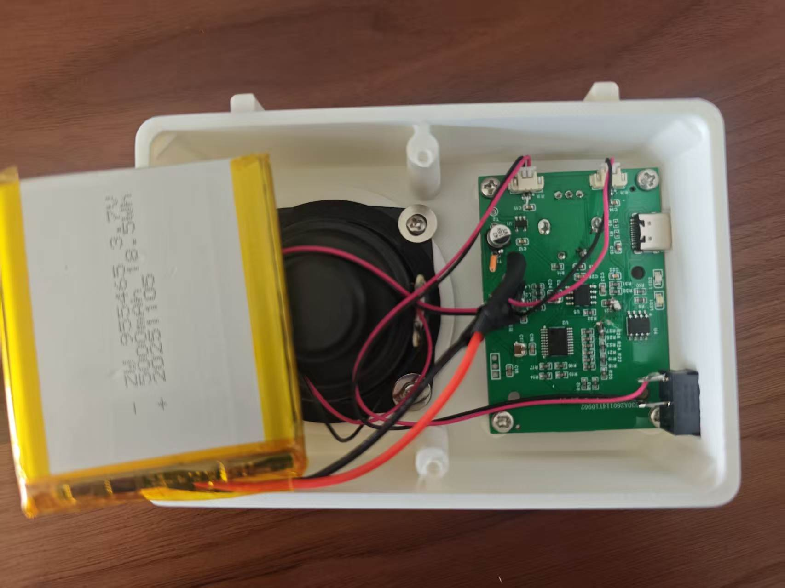

# 40Hz Audio Modulation Project

## [中文版](readme_cn.md)

## Project Overview

This project implements a 40Hz audio modulation system based on the CH32V003F4P6 microcontroller. It features R-2R network DAC output, OLED display for status monitoring, and rotary encoder for volume control.

This system is based on scientific research showing that 40Hz auditory stimulation is effective in treating Alzheimer's disease in mouse and monkey models. My mother also suffers from Alzheimer's disease, which inspired me to develop this system.

- [Multisensory gamma stimulation promotes glymphatic clearance of amyloid](https://www.nature.com/articles/s41586-024-07132-6)
- [Long-term effects of forty-hertz auditory stimulation as a treatment of Alzheimer’s disease: Insights from an aged monkey model study](https://pmc.ncbi.nlm.nih.gov/articles/PMC12799102/)

## Hardware Architecture

### Core Components

1. **Main Controller**: CH32V003F4P6 (RISC-V Core, 24MHz)
2. **DAC Output**: 6-bit R-2R resistor network
3. **Display Module**: 128x64 OLED I2C display
4. **Input Device**: Rotary encoder with push button
5. **Power Supply**: USB-C 5V

### Pin Assignment

| Function        | Pin | Description            |
| --------------- | --- | ---------------------- |
| DAC BIT0        | PC0 | Least significant bit  |
| DAC BIT1        | PC3 | <br />                 |
| DAC BIT2        | PC4 | <br />                 |
| DAC BIT3        | PC5 | <br />                 |
| DAC BIT4        | PC6 | <br />                 |
| DAC BIT5        | PC7 | Most significant bit   |
| I2C SCL         | PC2 | OLED clock line        |
| I2C SDA         | PC1 | OLED data line         |
| Encoder Phase A | PD5 | Rotary input A         |
| Encoder Phase B | PD6 | Rotary input B         |
| Encoder Button  | PD4 | Button input (pull-up) |

## Features

### Audio Modulation

- **Carrier Frequency**: 1kHz Sine Wave
- **Modulation Frequency**: 40Hz Sine Wave
- **Modulation Method**: Amplitude Modulation (AM)
- **Output Precision**: 6-bit R-2R DAC

### System Functions

1. **Volume Control**:
   - 0-63 level volume adjustment
   - Rotary encoder control
   - Auto-save volume to Flash memory
2. **Timer Function**:
   - Default 30-minute countdown
   - Auto-shutdown when time expires
   - Real-time remaining time display on OLED
3. **OLED Display**:
   - Project name
   - Current volume value
   - Remaining time
   - System status

## Software Implementation

### Core Algorithm

```c
// 1kHz sine wave table (64 points)
const u8 sine_table[SINE_TABLE_SIZE] = {
    32, 35, 38, 41, 44, 47, 50, 52,
    55, 57, 59, 61, 62, 63, 63, 63,
    63, 63, 63, 62, 61, 59, 57, 55,
    52, 50, 47, 44, 41, 38, 35, 32,
    29, 26, 23, 20, 17, 14, 11, 8,
    5,  3,  1,  0,  0,  0,  0,  0,
    0,  0,  0,  0,  1,  3,  5,  8,
    11, 14, 17, 20, 23, 26, 29, 32
};
```

### Modulation Principle

```c
// 40Hz AM modulation implementation
temp = (u16)sine_table[sine_index] * (am_value - 32) * volume / (64 * 64) + 32;
```

## Project Structure

```
.
├── PCB/                # Circuit board design files
│   ├── Schematic1/     # Schematic diagrams
│   ├── Gerber_PCB1_1_2026-04-08.zip  # Gerber files
│   └── PCB1_1.pcbdoc   # PCB design
├── Shell/              # 3D printed enclosure
│   ├── Back .stl
│   └── Front.stl
├── html/               # Web interface
│   └── index.html
└── software/           # Source code
    ├── 40HZ/           # Main project
    │   ├── Core/       # Core libraries
    │   ├── Debug/      # Debug module
    │   ├── Ld/         # Linker scripts
    │   ├── Peripheral/ # Peripheral drivers
    │   ├── Startup/    # Startup files
    │   └── User/       # User code
```

## Compilation and Programming

### Development Environment

- MounRiver Studio
- RISC-V GCC Toolchain
- WCH-Link Programmer

### Compilation Steps

1. Open MounRiver Studio
2. Import project: `software/40HZ/`
3. Compile the project
4. Generate `40HZ.hex` file

### Programming

1. Connect WCH-Link to development board
2. Select `40HZ.hex` file for programming
3. Execute programming

### PCB Manufacturing

The PCB files can be directly manufactured at [JLCPCB](https://www.jlc.com/).

<https://oshwhub.com/harlly/project_mxclzras>

### Programming Tool

Programming can be done using the [WCH-Link Programmer](https://www.wch.cn/downloads/WCH-LinkUtility_ZIP.html).

## User Guide

### Operation Instructions

1. **Power On**: Connect USB-C power
2. **Volume Adjustment**: Rotate encoder to adjust volume (0-63)
3. **Timer Function**: Default 30-minute countdown, auto-shutdown when time expires
4. **Volume Save**: Auto-save volume after 1 second of inactivity

### Display Interface

```
40Hz AM Wave
Volume: 32
Time: 30:00
```

## Hardware Manufacturing

### PCB Soldering

1. Solder CH32V003F4P6 microcontroller
2. Solder 6-bit R-2R resistor network
3. Solder OLED display module
4. Solder rotary encoder
5. Solder USB-C connector

### Enclosure

Shell/ 3D printed enclosure files

## Technical Details

### Clock Configuration

- System Clock: 24MHz
- TIM1 Timer: 64kHz interrupt
- Audio Output: 1kHz carrier wave
- Modulation Frequency: 40Hz

### Flash Memory

- Volume storage address: 0x08003C00
- Auto-save mechanism: Save after 1 second of volume change

## Appearance




## Troubleshooting

### Common Issues

1. **No Display**: Check OLED wiring connections
2. **No Audio Output**: Check R-2R network soldering
3. **Encoder Not Working**: Check pin connections
4. **Volume Not Saving**: Check Flash write code

## Version History

- V1.0.0 (2023/12/25): Initial release

## License

This project is based on WCH CH32V003 development board reference design, licensed under MIT License.

## References

- CH32V003 Datasheet
- SSD1315 OLED Driver Manual
- R-2R DAC Design Guide

